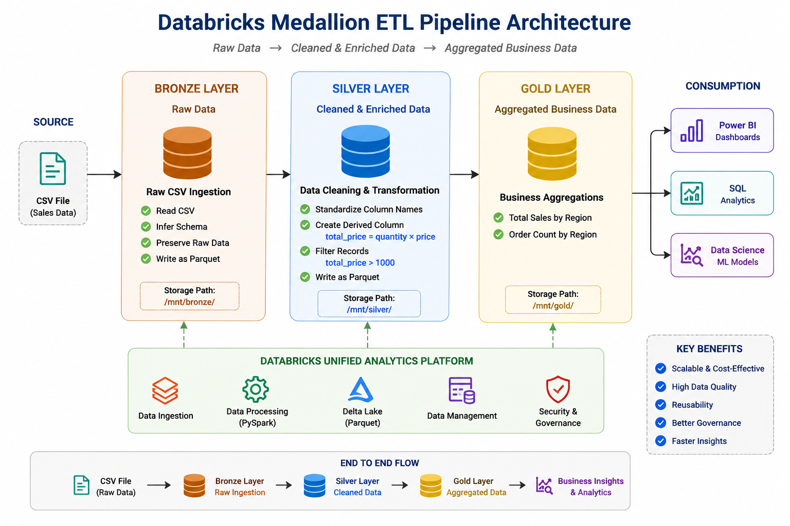
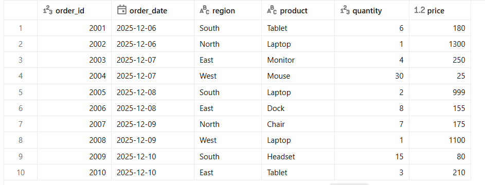
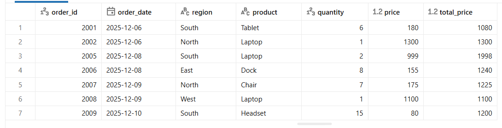
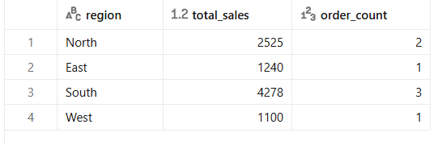

# 🚀 Databricks Medallion ETL Pipeline using PySpark



## 📖 Project Overview

This project demonstrates an end-to-end ETL pipeline built using **Databricks Community Edition** and **PySpark**, following the **Medallion Architecture (Bronze → Silver → Gold)**.

The pipeline ingests raw CSV data, transforms it into Parquet, enriches the data, and produces business-ready aggregated datasets.

---

## 🏗️ Architecture


---

## 🛠️ Technologies

- Databricks Community Edition
- Apache Spark
- PySpark
- Python
- Parquet
- Git
- GitHub

---

## 📂 Project Structure

```text
databricks-medallion-etl/
├── notebooks/
├── data/
├── images/
├── docs/
├── README.md
└── .gitignore
```

---

## 🔄 ETL Workflow

CSV File

↓

Bronze Layer (Raw Parquet)

↓

Silver Layer (Cleaned + Enriched)

↓

Gold Layer (Business Aggregations)

---

## Bronze Layer

- Read CSV
- Infer Schema
- Store Raw Data as Parquet

---

## Silver Layer

- Standardize column names
- Create `total_price`
- Filter records (`total_price > 1000`)

---

## Gold Layer

- Total Sales by Region
- Order Count by Region

---

## 📊 Sample Outputs

### Bronze



### Silver



### Gold



---

## 👨‍💻 Author

**Sunil Narayanareddy**

GitHub: https://github.com/Sunil43-DA
